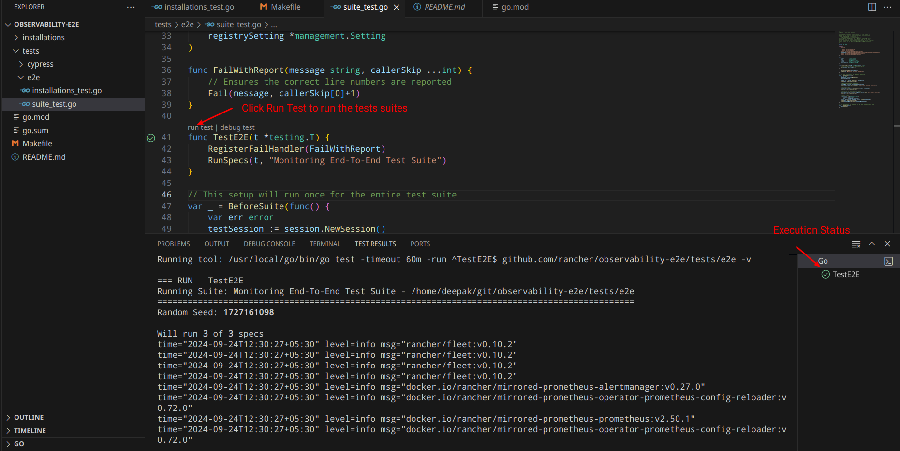

# Observability E2E Tests

This repository contains end-to-end (E2E) tests for monitoring installations in Rancher. Follow the steps below to set up and run the tests.

## Prerequisites

Before you start, ensure the following prerequisites are met:

- Go is installed on `1.22.0`.
- Rancher is installed and configured.
- Ensure you have cloned this repository.

## Configuration

Before running the tests, ensure the `cattle-config.yaml` file is correctly configured. This file contains essential parameters for running the tests.

### Example `cattle-config.yaml`

```yaml
rancher:
  host: <Rancher URL>
  adminToken: <Your Admin Token>
  insecure: True
  clusterName: local
  cleanup: false
```

Make sure to replace the placeholder values (`<Rancher URL>`, `<Your Admin Token>`) with the actual values.

## Running Tests

### 1. Via Command Line

Go to the `observability-e2e` directory and run the following command:

```bash
go test -timeout 60m -run ^TestE2E$ github.com/rancher/observability-e2e/tests/e2e -v
```

This command will:

- Run the E2E test suite located in the `tests/e2e/` directory.
- Display detailed output about the test progress and results.

### Example Test Output:

```bash
=== RUN   TestE2E
Running Suite: Monitoring End-To-End Test Suite - /Path/observability-e2e/tests/e2e
====================================================================================
Random Seed: 1727161098

Will run 3 of 3 specs
....<snip>....
time="2024-09-24T12:31:31+05:30" level=info msg="rancher/mirrored-coredns-coredns:1.10.1"
•

Ran 3 of 3 Specs in 192.847 seconds
SUCCESS! -- 3 Passed | 0 Failed | 0 Pending | 0 Skipped
--- PASS: TestE2E (192.85s)
PASS
ok      github.com/rancher/observability-e2e/tests/e2e  (cached)
```

### 2. Via VS Code

If you're using **VS Code**, you can also run the tests directly within the editor:

1. Open the `suite_test.go` file located at `tests/e2e/suite_test.go`.
2. Click on **"Run Test"** next to the `TestE2E` function (as indicated in the attached screenshot).
3. Monitor the test execution status in the **Test** panel within VS Code.

Below is the ScreenShot Attched:


